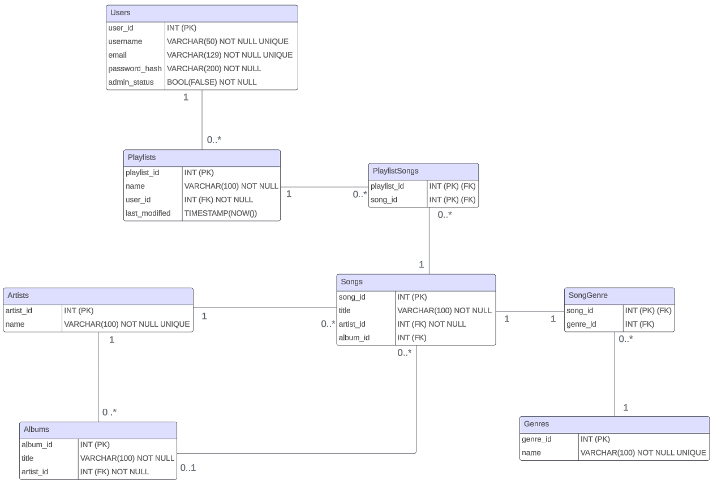

# Music Database

Music Database is a Python desktop application for managing artists, albums, songs, genres and personal playlists. It combines a Tkinter user interface with a PostgreSQL database and bcrypt-based password hashing.

## Features

- create accounts and sign in with a username or email address
- store passwords as bcrypt hashes
- search for songs, artists and albums
- create, rename and delete personal playlists
- add and remove songs from playlists
- manage artists, albums, genres and songs through an administrator view
- keep playlist modification timestamps up to date in PostgreSQL

## Technology

- Python 3.11+
- Tkinter
- PostgreSQL
- psycopg2
- bcrypt

## Project structure

```text
database/              PostgreSQL schema and optional sample catalog
docs/                  entity-relationship diagram
src/music_database/    application source code
tests/                 configuration and validation tests
run.py                 application entry point
```

## Setup

### 1. Create a virtual environment

```powershell
py -m venv .venv
.\.venv\Scripts\Activate.ps1
python -m pip install --requirement requirements.txt
```

### 2. Configure PostgreSQL

Create an empty database named `music_database`, then apply the schema:

```powershell
createdb -U postgres music_database
psql -U postgres -d music_database -f database/schema.sql
```

The optional sample catalog can be added without creating user accounts:

```powershell
psql -U postgres -d music_database -f database/seed.sql
```

### 3. Configure the application

Copy `.env.example` to `.env` and replace the placeholder password with the password of your local PostgreSQL user. The `.env` file is ignored by Git.

### 4. Start the application

```powershell
python run.py
```

Create a user through the start screen. To use the administrator view, set that local user's `admin_status` to `TRUE` in PostgreSQL:

```sql
UPDATE Users SET admin_status = TRUE WHERE username = 'your-user-name';
```

## Data model



## Development checks

Install the optional development tools and run the checks locally:

```powershell
python -m pip install --requirement requirements-dev.txt
ruff format --check src tests run.py
ruff check src tests run.py
python -m unittest discover -s tests -v
python -m pip_audit --requirement requirements.txt
```

The PostgreSQL integration tests run automatically in GitHub Actions.

## Security notes

- database credentials are read from a local `.env` file and are not committed
- passwords are hashed with bcrypt before they are stored
- SQL parameters are passed separately from user input
- the setup scripts do not delete an existing database

## License

No open-source license is provided. The source code is published for portfolio and demonstration purposes only.
